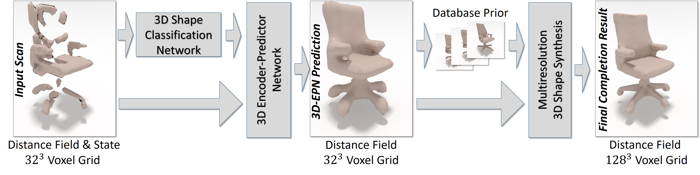

# cnncomplete

This repo contains code to train a volumetric deep neural network to complete partially scanned 3D shapes.
More information can be found in our <a href="https://arxiv.org/pdf/1612.00101.pdf">paper</a>.


<a href="https://arxiv.org/pdf/1612.00101.pdf">

</a>


## Data
Train/test data is available for download on our [project website](http://graphics.stanford.edu/projects/cnncomplete). 

## Code
### Installation:  
Training tasks use [Torch7](http://torch.ch/docs/getting-started.html), with torch packages `cudnn`, `cunn`, `torch-hdf5`, `xlua`.

The shape synthesis code was developed under VS2013, and uses `flann` (included in [external](external)). 

### Training:  
* `th train_class.lua -model epn-unet-class -save logs-epn-unet-class -train_data data/h5_shapenet_dim32_sdf/train_shape_voxel_data_list.txt -test_data data/h5_shapenet_dim32_sdf/test_shape_voxel_data_list.txt -gpu_index 0`    
* Trained models: [trained_models.zip](https://dovahkiin.stanford.edu/cnncomplete-public/trained_models.zip) (700mb)

## Citation:  
```
@inproceedings{dai2017complete,
  title={Shape Completion using 3D-Encoder-Predictor CNNs and Shape Synthesis},
  author={Dai, Angela and Qi, Charles Ruizhongtai and Nie{\ss}ner, Matthias},
  booktitle = {Proc. Computer Vision and Pattern Recognition (CVPR), IEEE},
  year = {2017}
}
```

## License
This code is released under a Creative Commons Attribution-NonCommercial-ShareAlike 4.0 International License (please refer to [LICENSE.txt](LICENSE.txt) for details).

## Contact:
If you have any questions, please email Angela Dai at adai@cs.stanford.edu.
